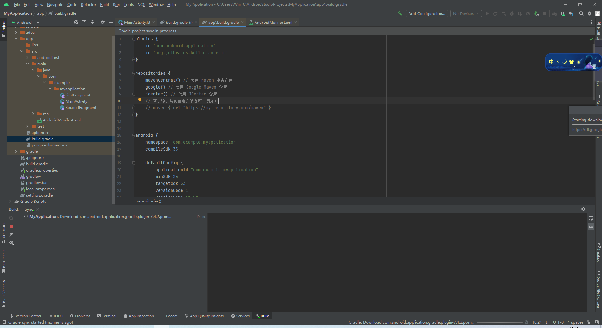
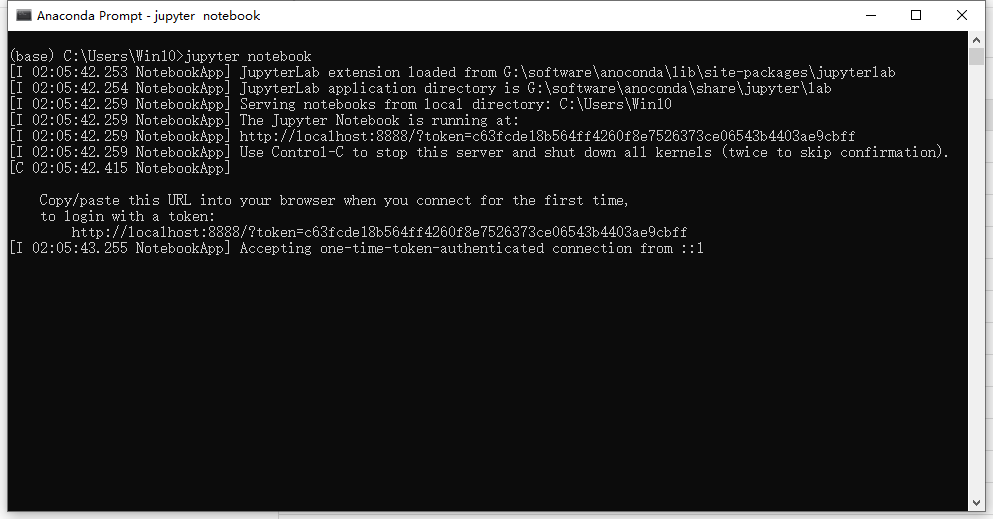

# 安装相关软件

## 安装Android Studio 

### [官网下载](https://developer.android.com/studio?gclid=EAIaIQobChMI-O-K4b2X_gIVtBx9Ch1_YAm-EAAYASAAEgKxZvD_BwE&gclsrc=aw.ds)

### 等待安装过程

### 安装包下载完毕之后打开安装包

### 选择安装路径

### 等待安装

### 安装完成

### 安装过程中的一些问题

#### 缺失SDK配置

出现如下报错：

Nothing to do!
Android SDK is up to date.
SDK emulator directory is missing

好像发现是代理的问题，节点没选对0.0  然后就无法自动下载，换了下节点之后重启了一下软件，接着就自动找到所需的SDK了

##### 等待默认代理下载SDK 

##### 下载完成！

接下来就可以正常使用了

选择一个模板，例如basic Activity创建后：

还需要等待下载相应的gradle配置

在 Gradle 中配置依赖仓库，可以通过在 `build.gradle` 文件中添加以下内容：

repositories {
    mavenCentral() // 使用 Maven 中央仓库
    google() // 使用 Google Maven 仓库
    jcenter() // 使用 JCenter 仓库
    // 可以添加其他自定义的仓库，例如：
    // maven { url "https://my-repository.com/maven" }
}

配置仓库如下：

#### gradle配置缺失

##### 解决办法：

还是代理节点的问题，通过更换节点之后，我删除了原本的http代理，将.gradle文件夹目录下的gradle.properties删掉，重新配置http代理，然后重启android studio即可

#### 又出现了一个问题

可能是因为gradle加载一半改代理有部分依赖包无法导入的原因，在我清空完gradle配置后重新加载项目就可以了

## 安装Jupyter Notebook

由于之前已经安装过了，就浅浅显示一下Jupyter Notebook的运行

首先打开anaconda promote

输入jupyter notebook

即可

## 安装Visual Studio Code

已安装过 这部分就不演示了

## 安装异常：anaconda后出现anaconda navigator打不开的情况

#### 无法打开Navigator(AttributeError: ‘str‘ object has no attribute ‘get‘)

[解决办法参考文献](https://blog.csdn.net/Myblog_7267/article/details/115340107?ops_request_misc=%257B%2522request%255Fid%2522%253A%2522168097774916800188591637%2522%252C%2522scm%2522%253A%252220140713.130102334.pc%255Fall.%2522%257D&request_id=168097774916800188591637&biz_id=0&utm_medium=distribute.pc_search_result.none-task-blog-2~all~first_rank_ecpm_v1~rank_v31_ecpm-3-115340107-null-null.142^v82^insert_down38,201^v4^add_ask,239^v2^insert_chatgpt&utm_term=anaconda%20navigator%20%20AttributeError%3A%20str%20object%20has%20no%20attribute%20get&spm=1018.2226.3001.4187)
